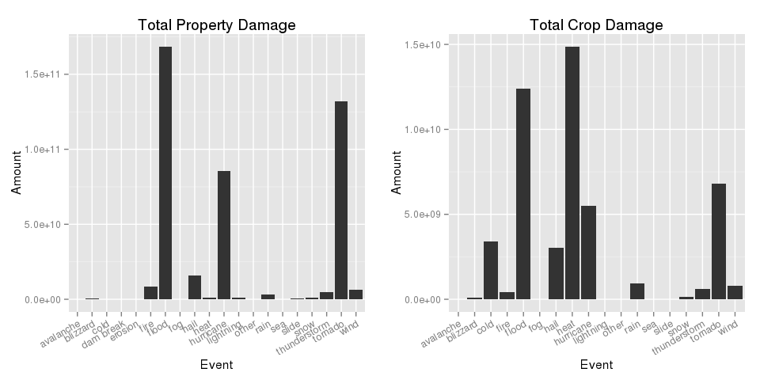
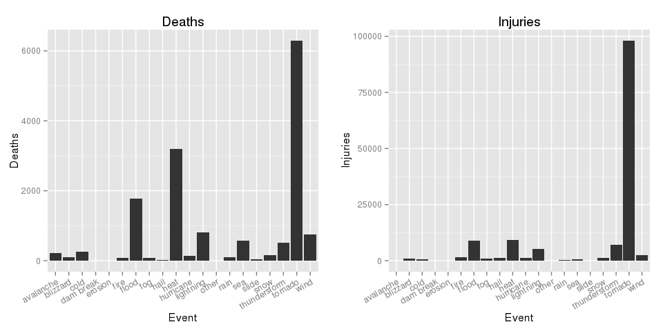
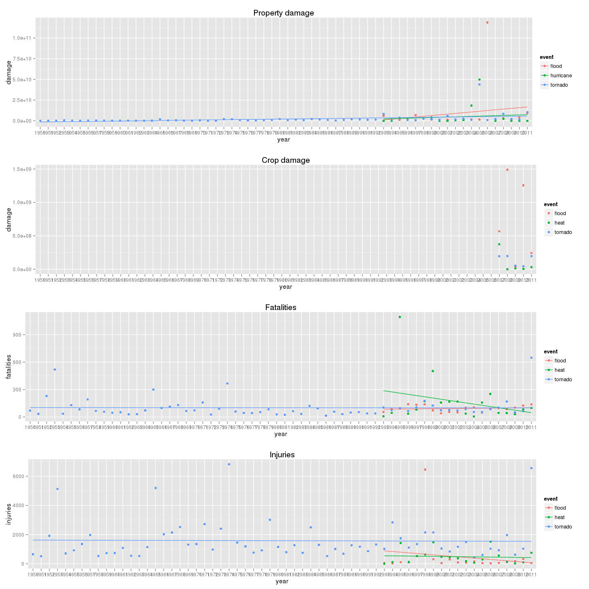

# Reproducible Research: Peer Assessment 2
Jörg Mülller  
10/20/2014  

# US Weather Storm Data Analysis


## Synopsis 
US Weather Storm data has been collected since the 1950s. We analyze the most harmful weather events with respect to population health and economic damage. Data has not been very consistently recorded, especially concering the event type description. A detailed code section shows how weather events have been grouped. As a result, the three most damaging weather events for population health are (1) tornado, (2) heat and (3) flood. The three most damaging events on an economic scale are (1) flood, (2) tornado, (3) hurriance for property damange and (1) heat, (2) flood, (3) tornado for crop damage. Regarding historic trends, it seems that although there is only a slight increase in the overall economic damage, weather events become more extreme with several high impact events in recent decades. 


## Data Processing

Read the data file and take a look at the event type variable. 


```r
df <- read.csv('repdata_data_StormData.csv', header=T, sep=",")
levels(df$EVTYPE)[seq(1,900,20)]
```

```
##  [1] "   HIGH SURF ADVISORY"          "Beach Erosion"                 
##  [3] "BLOWING DUST"                   "COASTAL SURGE"                 
##  [5] "COOL AND WET"                   "DRY MICROBURST"                
##  [7] "Early Frost"                    "EXTREME COLD/WIND CHILL"       
##  [9] "FLASH FLOOD/FLOOD"              "FLOOD/RAIN/WIND"               
## [11] "FREEZING RAIN"                  "Glaze"                         
## [13] "Gusty winds"                    "HAIL 80"                       
## [15] "HEAT/DROUGHT"                   "HEAVY RAIN/SNOW"               
## [17] "HEAVY SNOW-SQUALLS"             "HEAVY SURF COASTAL FLOODING"   
## [19] "HIGH WIND 48"                   "HIGH WINDS 66"                 
## [21] "HOT/DRY PATTERN"                "ICE JAM"                       
## [23] "LAKESHORE FLOOD"                "LIGHT SNOW/FREEZING PRECIP"    
## [25] "LOW TEMPERATURE RECORD"         "MIXED PRECIP"                  
## [27] "MUDSLIDES"                      "RAIN (HEAVY)"                  
## [29] "RECORD HIGH TEMPERATURE"        "RECORD/EXCESSIVE RAINFALL"     
## [31] "Seasonal Snowfall"              "SMALL STREAM AND URBAN FLOODIN"
## [33] "SNOW DROUGHT"                   "SNOW/SLEET"                    
## [35] "Summary August 10"              "Summary of July 11"            
## [37] "Summary of March 23"            "Summary September 4"           
## [39] "THUNDERSTORM WIND (G40)"        "THUNDERSTORM WIND/ TREE"       
## [41] "THUNDERSTORM WINDS HAIL"        "THUNDERSTORMW"                 
## [43] "TORNADOES"                      "TSTM WIND (G45)"               
## [45] "UNSEASONABLY COLD"
```
As can be readily seen from the small sample of event type entries, there are hundreds of different event types, some of them not indicating any weather related event at all, such as the "Summary" entries for specific dates or the "?" entries. In order to clean the data and reduce the number of events, several steps will be carried out: 

1. Delete rows with unknown event type 
2. Convert all entries to lowercase
3. Group them according to the overarching term discarding especially the qualifiying attributes such as "excessive", "extreme" or numeric qualifiers to distinguish for example the severity of "hail". This step is carried out by regular expression matching in order to also catch spelling mistakes or plurals. Overall, this cleaning step  will reduce the number of events from 985 to 20. The grouping of the event type variable is not based on any metereological expert decisions and certainly could be improved. The following code shows how event types have been grouped: 


```r
df <- df[!(df$EVTYPE=="?"),]

df$evtype <- tolower(df[,8])

df[grep("torn*|funnel*|microburst", df$evtype),]$evtype <- c("tornado")
df[grep("thunderstorm*|tstm*|storm*|downburst", df$evtype),]$evtype <- c("thunderstorm")
df[grep("hurricane*|typh*|tropical depression", df$evtype),]$evtype <- c("hurricane")
df[grep("blizzard*", df$evtype),]$evtype <- c("blizzard")
df[grep("flood*|water*|surf*|swells*|tsunami*|fldg|fld|stream", df$evtype),]$evtype <- c("flood")
df[grep("snow*", df$evtype),]$evtype <- c("snow")
df[grep("*wind*|wnd", df$evtype),]$evtype <- c("wind")
df[grep("cold*|frost*|chill*|freez*|glaze*|ice|icy|low|cool*", df$evtype),]$evtype <- c("cold")
df[grep("rain*|wet|percipi*|preci*|shower*", df$evtype),]$evtype <- c("rain")
df[grep("dry|heat*|driest|drought*|high*|warm*|dust*|hot", df$evtype),]$evtype <- c("heat")
df[grep("hail*|sleet*", df$evtype),]$evtype <- c("hail")
df[grep("light*|lign*", df$evtype),]$evtype<- c("lightning")
df[grep("*slide*", df$evtype),]$evtype<- c("slide")
df[grep("*fire|smoke*", df$evtype),]$evtype<- c("fire")
df[grep("avalanc*", df$evtype),]$evtype<- c("avalanche")
df[grep("fog|vog|cloud", df$evtype),]$evtype<- c("fog")
df[grep("dam ", df$evtype),]$evtype<- c("dam break")
df[grep("erosi*", df$evtype),]$evtype<- c("erosion")
df[grep("rogue|rough|rip", df$evtype),]$evtype<- c("sea")
df[grep("apache|seiche|drowning|cloud|floyd|rotating|volcanic|summary*|excessive|gustnado|hypothermia|landslump|landspout|wayterspout|no severe|marine*|mild|monthly|none|other|record*|red|turbulence|urban*", df$evtype),]$evtype<- c("other")
```

After this grouping, the 902296 rows of the dataset are distributed across the following categories: 


```r
table(df$evtype)
```

```
## 
##    avalanche     blizzard         cold    dam break      erosion 
##          387         2743         3154            5            6 
##         fire        flood          fog         hail         heat 
##         4260        91090         1846       289327         5866 
##    hurricane    lightning        other         rain          sea 
##          359        15765          278        11972          778 
##        slide         snow thunderstorm      tornado         wind 
##          646        17668       227239       192535        36372
```

The subsequent steps consists of preparing the "property damange" and "population health" variables in order to answer the questions regarding the most harmful events to population health and greatest economic consequences. 


### Property damage
Property damange is split between property and crop damange; in both cases two variables need to be combined in order to calculte the actual damage: PROPDMG contains a numeric value that needs to multiplied with its corresponding exponential value contained in PROPDMGEXP. Closer examination of PROPDMGEXP gives the following entries: 


```r
levels(df$PROPDMGEXP)
```

```
##  [1] ""  "-" "?" "+" "0" "1" "2" "3" "4" "5" "6" "7" "8" "B" "h" "H" "K"
## [18] "m" "M"
```

The character entries will be converted to numeric according to the following table:

* H or h = 2 (hundred = 10^2) 
* K or k = 3 (thousand = 10^3) 
* M or m = 6 (million = 10^6) 
* B or b = 9 (billion = 10^9) 

What more, the remaining characters "+", "?", "-", and "" will be converted to the exponent 0. The meaning of the characters is not documented in the available data handbooks. Therefore, converting them to 10^0=1 will leave the actual damage numeric value unaffected. Overall, the total damage will be calculated by: PROPDMG * 10^PROPDMGEXP. 


```r
df$propdmgexp <- gsub("[-|?|+]","0",as.character(df$PROPDMGEXP) )
df$propdmgexp <- gsub("[H|h]","2",as.character(df$propdmgexp) )
df$propdmgexp <- gsub("[K|k]","3",as.character(df$propdmgexp) )
df$propdmgexp <- gsub("[M|m]","6",as.character(df$propdmgexp) )
df$propdmgexp <- gsub("[B|b]","9",as.character(df$propdmgexp) )
df[df$propdmgexp=="",]$propdmgexp <- "0"

df$propdmgtot <- df$PROPDMG * 10^as.integer(df$propdmgexp)
```


Finally, we aggregate the total damange for each event type variable. 

```r
propdmgByEvtype <- aggregate(df$propdmgtot ~ df$evtype, FUN=sum)
names(propdmgByEvtype) <- c("Event", "Amount")
```


### Crop Damage
The same procedure applies for preparing and calculating the crop damage: 

```r
df$cropdmgexp <- gsub("[?|+]","0",as.character(df$CROPDMGEXP) )
df$cropdmgexp <- gsub("[K|k]","3",as.character(df$cropdmgexp) )
df$cropdmgexp <- gsub("[M|m]","6",as.character(df$cropdmgexp) )
df$cropdmgexp <- gsub("[B|b]","9",as.character(df$cropdmgexp) )

df$cropdmgtot <- df$CROPDMG * 10^as.integer(df$cropdmgexp)
```

The total crop damange for each event type is aggregated. 

```r
cropdmgByEvtype <- aggregate(df$cropdmgtot ~ df$evtype, FUN=sum)
names(cropdmgByEvtype) <- c("Event", "Amount")
```


### Impact on population health (injuries + fatalities)
Both, the fatalities and injuries variables of the dataset are numeric and can be used straight away. For both cases, the counts are aggregated over the event types. 


```r
pophealth <- aggregate(df$FATALITIES ~ df$evtype, FUN=sum)
pophealth$Injuries <- aggregate(df$INJURIES ~ df$evtype, FUN=sum)[,2]
names(pophealth) <- c("Event", "Deaths", "Injuries")
```

### Exploring historical trends
In order to explore the trends of the damages, injuries and fatalities over the years, we convert the beginning date (BGN_DATE) to an object of type "Date" and group "property damage", "crop damage", "injuries" and "fatalities" for all event types.


```r
df$DateTime <- strptime(df$BGN_DATE, "%m/%d/%Y %H:%M:%S")
df$Year <- format(df$DateTime, "%Y")
trend.p <- aggregate(df$propdmgtot, by=list(df$evtype, df$Year), FUN=sum)
trend.c <- aggregate(df$cropdmgtot, by=list(df$evtype, df$Year), FUN=sum)
trend.f <- aggregate(df$FATALITIES, by=list(df$evtype, df$Year), FUN=sum)
trend.i <- aggregate(df$INJURIES, by=list(df$evtype, df$Year), FUN=sum)

names(trend.p) <- c("event", "year", "damage")
names(trend.c) <- c("event", "year", "damage")
names(trend.f) <- c("event", "year", "fatalities")
names(trend.i) <- c("event", "year", "injuries")
```


## Results

### Regarding population health
Across the United States, which types of events are most harmful with respect to population health? Considering this first question, let's look at the ordered tables for injuries and fatalities per event types: 


```r
pophealth[with(pophealth, order(-Injuries)),c(1,3)]
```

```
##           Event Injuries
## 19      tornado    98134
## 10         heat     9299
## 7         flood     9085
## 18 thunderstorm     7065
## 12    lightning     5231
## 20         wind     2551
## 6          fire     1608
## 9          hail     1371
## 11    hurricane     1333
## 17         snow     1165
## 8           fog     1076
## 2      blizzard      806
## 3          cold      730
## 15          sea      536
## 14         rain      302
## 1     avalanche      170
## 16        slide       55
## 13        other       11
## 4     dam break        0
## 5       erosion        0
```

Regarding number of *injuries*, the most harmful events are (1) tornados, (2) heat related weather events, and (3) floods. 

Regarding *fatalities*, the picture is quite similar. The three most harmful events are again (1) tornados, (2) heat, and (3) flooding. Curious is the fact that there are more fatalities through lightning than for example hurricane or heavy winds. 

```r
pophealth[with(pophealth, order(-Deaths)),c(1,2)]
```

```
##           Event Deaths
## 19      tornado   6298
## 10         heat   3189
## 7         flood   1768
## 12    lightning    817
## 20         wind    747
## 15          sea    580
## 18 thunderstorm    519
## 3          cold    254
## 1     avalanche    225
## 17         snow    169
## 11    hurricane    135
## 14         rain    102
## 2      blizzard    101
## 6          fire     90
## 8           fog     80
## 16        slide     44
## 9          hail     17
## 13        other     10
## 4     dam break      0
## 5       erosion      0
```

### Regarding economic damage
Across the United States, which types of events have the greatest economic consequences? Looking at property damage first, the most harmful events are (1) flooding, (2) tornados and (3) hurricanes. 


```r
propdmgByEvtype[with(propdmgByEvtype, order(-Amount)), ]
```

```
##           Event    Amount
## 7         flood 1.685e+11
## 19      tornado 1.319e+11
## 11    hurricane 8.536e+10
## 9          hail 1.574e+10
## 6          fire 8.497e+09
## 20         wind 6.232e+09
## 18 thunderstorm 4.544e+09
## 14         rain 3.218e+09
## 10         heat 1.078e+09
## 17         snow 1.020e+09
## 12    lightning 9.354e+08
## 2      blizzard 6.644e+08
## 16        slide 3.268e+08
## 3          cold 1.693e+08
## 8           fog 2.283e+07
## 1     avalanche 3.722e+06
## 13        other 2.325e+06
## 4     dam break 1.002e+06
## 5       erosion 8.660e+05
## 15          sea 1.630e+05
```

In relation to *crop damage*, it turns out that excessive (1) heat causes the most damage, followed by (2) flooding, (3) tornados and (4) hurricanes. What is also noteworthy are the important economic losses due to hail and cold. 

```r
cropdmgByEvtype[with(cropdmgByEvtype, order(-Amount)), ]
```

```
##           Event    Amount
## 8          heat 1.488e+10
## 5         flood 1.239e+10
## 17      tornado 6.824e+09
## 9     hurricane 5.516e+09
## 3          cold 3.411e+09
## 7          hail 3.047e+09
## 12         rain 9.467e+08
## 18         wind 7.900e+08
## 16 thunderstorm 6.187e+08
## 4          fire 4.033e+08
## 15         snow 1.347e+08
## 2      blizzard 1.121e+08
## 14        slide 2.002e+07
## 10    lightning 1.209e+07
## 11        other 1.036e+06
## 1     avalanche 0.000e+00
## 6           fog 0.000e+00
## 13          sea 0.000e+00
```


### Summarizing graphics
The following graphics represent the property and crop damange: 


```r
library(ggplot2)
library(gridExtra)
```

```
## Loading required package: grid
```

```r
p1 <- ggplot(propdmgByEvtype, aes(x=Event, y=Amount)) + geom_bar(stat="identity") + theme(axis.text.x = element_text(angle=30, hjust=1, vjust=1)) + ggtitle("Total Property Damage")

p2 <-ggplot(cropdmgByEvtype, aes(x=Event, y=Amount)) + geom_bar(stat="identity") + theme(axis.text.x = element_text(angle=30, hjust=1, vjust=1)) + ggtitle("Total Crop Damage")

grid.arrange(p1, p2, ncol=2)
```

 

And the fatalities and injuries regarding event types. 


```r
p3 <- ggplot(pophealth, aes(x=Event, y=Deaths ) ) + geom_bar(stat="identity") + theme(axis.text.x = element_text(angle=30, hjust=1, vjust=1)) + ggtitle("Deaths")

p4 <- ggplot(pophealth, aes(x=Event, y=Injuries ) ) + geom_bar(stat="identity") + theme(axis.text.x = element_text(angle=30, hjust=1, vjust=1)) + ggtitle("Injuries")

grid.arrange(p3, p4, ncol=2)
```

 


Floodings and tornados are among the most damaging weather events in the US, both for property/crop and population health. A final exploration shows eventual historical trends for top three damaging weather events in each category (property, crop, injuries, fatalities).


```r
trend.p <- subset(trend.p, (event=="tornado" | event=="hurricane" | event=="flood"))
trend.c <- subset(trend.c, (event=="tornado" | event=="heat" | event=="flood"))
trend.f <- subset(trend.f, (event=="tornado" | event=="heat" | event=="flood"))
trend.i <- subset(trend.i, (event=="tornado" | event=="heat" | event=="flood"))

p1 <- ggplot(trend.p, aes(x=year, y=damage, colour=event, group=event)) + geom_point()+ geom_smooth(method=lm, se=FALSE) + ggtitle("Property damage")
p2 <- ggplot(trend.c, aes(x=year, y=damage, colour=event, group=event)) + geom_point()  + ggtitle("Crop damage")
p3 <- ggplot(trend.f, aes(x=year, y=fatalities, colour=event, group=event)) + geom_point()+ geom_smooth(method=lm, se=FALSE) + ggtitle("Fatalities")
p4 <- ggplot(trend.i, aes(x=year, y=injuries, colour=event, group=event)) + geom_point() + geom_smooth(method=lm,se=FALSE) + ggtitle("Injuries")

grid.arrange(p1, p2, p3,p4, ncol=1)
```

```
## Warning: Removed 85 rows containing missing values (geom_point).
```

 

Interestingly, injuries and fatalities are dropping; a fact probably having to do with better protection (air conditioning against excessive heat) mechanisms and early warning (accurate weather forecasts) in place. Apart from the more precise recording of weather events in more recent history, the property and crop damage show slightly but definite increasing trends. This is especially true for Tornados: whereas in the past they seem to be relatively stable phenomena, the damage caused starts to show increasingly sever peaks in recent decades. 


